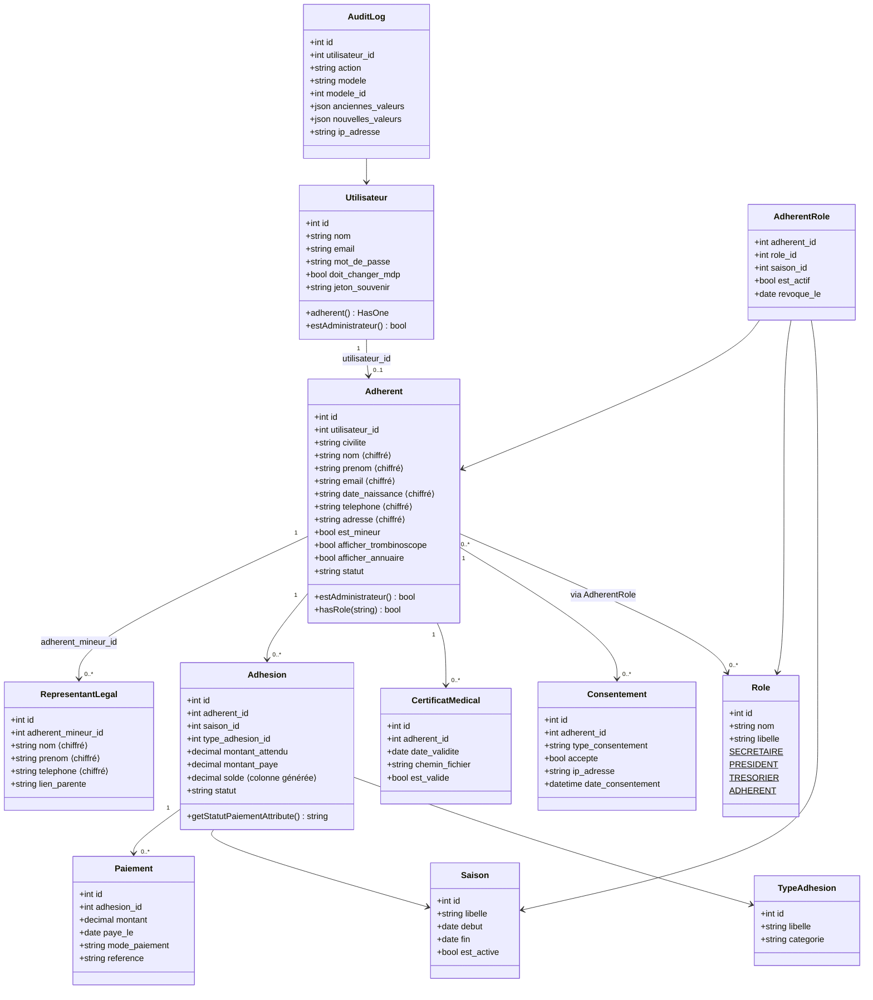
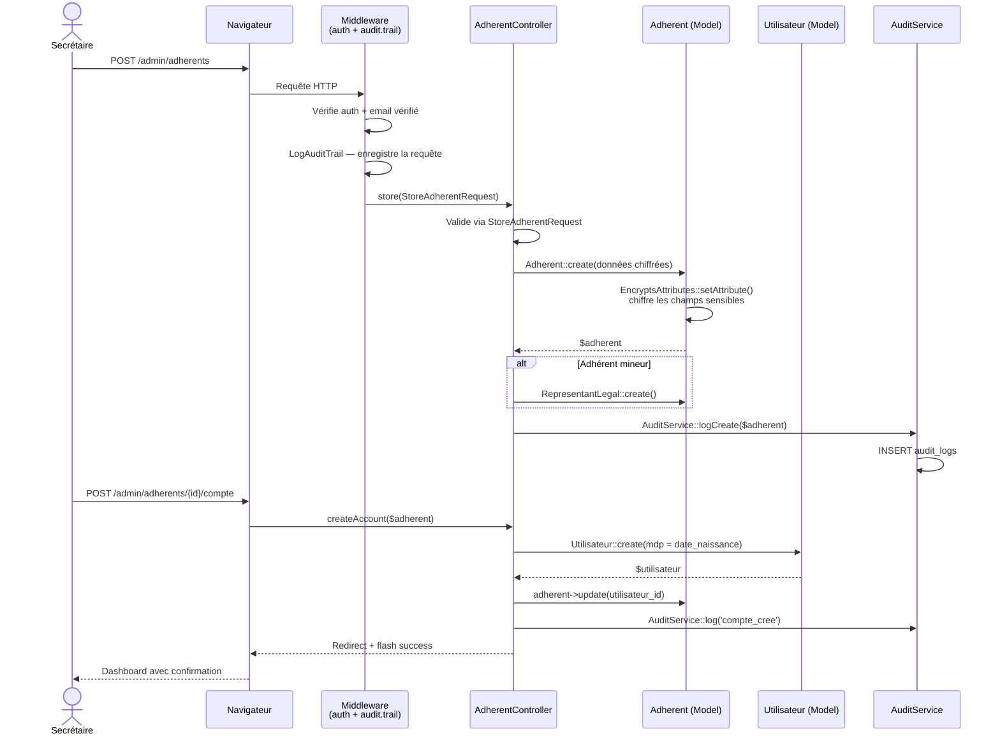

# Lyon Palme — Plateforme de Gestion Interne

> Application privée développée pour la gestion interne du club Lyon Palme (palmage / nage avec palmes), affilié FFESSM — Comité régional AURA, basé à Vénissieux.

Projet BTS SIO — périmètre **US1–US18** entièrement livré.

---

## Périmètre livré (US1–US18)

> Les modules planning / séances / sorties / compétitions / matériel sont **hors-scope** — leurs tables existent mais ne sont pas exposés.

| Domaine | User Stories | Fonctionnalités |
|---|---|---|
| Sécurité & RGPD | US1–US3 | Politique CNIL, piste d'audit, chiffrement AES-256, consentements |
| Espace Secrétaire | US4–US11 | Login, CRUD adhérents (avec mineur + représentant légal), archivage, certificats médicaux, cotisations & paiements, exports Excel |
| Espace Nageur | US12–US18 | Login / reset mdp (Fortify), profil self-service, opt-in trombinoscope / annuaire, listings |

---

## Diagramme de cas d'utilisation

```mermaid
graph TD
    SEC([Secrétaire / Admin])
    NAG([Nageur / Adhérent])

    SEC --> UC1[Se connecter]
    SEC --> UC2[Changer son mot de passe]
    SEC --> UC3[Créer / modifier un adhérent]
    SEC --> UC4[Archiver / restaurer un adhérent]
    SEC --> UC5[Créer un compte nageur]
    SEC --> UC6[Uploader un certificat médical]
    SEC --> UC7[Consulter le tableau de bord certificats]
    SEC --> UC8[Exporter les certificats Excel]
    SEC --> UC9[Gérer les cotisations / adhésions]
    SEC --> UC10[Enregistrer un paiement]
    SEC --> UC11[Exporter les cotisations Excel]
    SEC --> UC12[Consulter les journaux d'audit]

    NAG --> UC13[Se connecter]
    NAG --> UC14[Réinitialiser son mot de passe]
    NAG --> UC15[Modifier son profil self-service]
    NAG --> UC16[Activer / désactiver opt-in trombinoscope]
    NAG --> UC17[Consulter le trombinoscope]
    NAG --> UC18[Consulter l'annuaire]
```



---

## Diagramme de classes



---

## Diagramme de séquence — Création d'un adhérent avec compte nageur



---

## Arborescence

```
lyonpalme/
├── app/
│   ├── Actions/Fortify/          # Actions d'authentification (Fortify)
│   ├── Exports/                  # Exports Excel (maatwebsite)
│   │   ├── CertificatsMedicauxExport.php
│   │   └── CotisationsExport.php
│   ├── Http/
│   │   ├── Controllers/          # Un contrôleur par domaine métier
│   │   ├── Middleware/           # Middleware sécurité (audit, admin, throttle…)
│   │   └── Requests/             # Form Requests (validation)
│   ├── Models/                   # Modèles Eloquent (nommage français)
│   ├── Providers/
│   │   ├── AppServiceProvider.php
│   │   └── FortifyServiceProvider.php   # Config auth custom
│   ├── Services/                 # Services statiques réutilisables
│   │   ├── AuditService.php
│   │   ├── PasswordPolicyService.php
│   │   ├── FileSecurityService.php
│   │   ├── InputSanitizationService.php
│   │   └── RGPDComplianceService.php
│   └── Traits/
│       └── EncryptsAttributes.php       # Chiffrement AES-256 transparent
├── bootstrap/
│   └── app.php                   # Registration middleware + providers (Laravel 12)
├── database/
│   ├── factories/
│   ├── migrations/
│   └── seeders/
├── resources/
│   ├── css/app.css               # Tailwind 4 (@import "tailwindcss" + @theme)
│   ├── js/
│   └── views/
│       ├── layouts/              # app.blade, auth.blade, public.blade
│       ├── admin/                # Vues secrétariat (adherents, certificats, cotisations…)
│       ├── auth/                 # Vues Fortify (login, reset, verify…)
│       ├── dashboard/            # secretary.blade / adherent.blade
│       ├── mon-profil/           # Espace nageur self-service
│       ├── trombinoscope/
│       └── annuaire/
├── routes/
│   └── web.php                   # Toutes les routes (public + auth + admin)
├── tests/
│   ├── Feature/
│   └── Unit/
├── CLAUDE.md
├── COMPTES_TEST.md               # Comptes de test après seeder
└── init.txt                      # Document de planification initial (BTS SIO)
```

---

## Prérequis

- PHP >= 8.4
- Composer
- Node.js & NPM
- MariaDB (base `lyonpalme`)

## Installation

```bash
# Cloner puis installation complète
composer setup
```

Ou manuellement :

```bash
composer install
cp .env.example .env
php artisan key:generate
# Configurer DB_* dans .env
php artisan migrate
npm install && npm run build
```

Configuration `.env` minimale :

```env
DB_CONNECTION=mariadb
DB_HOST=127.0.0.1
DB_PORT=3306
DB_DATABASE=lyonpalme
DB_USERNAME=root
DB_PASSWORD=votre_mot_de_passe
```

### Données de test

```bash
php artisan migrate:fresh --seed
```

Génère ~100 adhérents + les comptes de test (liste complète dans `COMPTES_TEST.md`). Mot de passe `password` pour tous :

| Email | Rôle |
|---|---|
| `admin@lyonpalme.fr` | Administration |
| `president@lyonpalme.fr` | Président |
| `secretaire@lyonpalme.fr` | Secrétaire |
| `tresorier@lyonpalme.fr` | Trésorier |

---

## Utilisation

```bash
composer dev      # Serveur + queue + logs + Vite (hot reload)
npm run build     # Build assets production
```

---

## Tests

```bash
composer test                                      # Suite complète
php artisan test --filter=AdherentControllerTest   # Un seul test
php artisan test tests/Feature/EncryptionTest.php  # Un seul fichier
```

> Les tests tournent sur la vraie base MariaDB `lyonpalme` (`RefreshDatabase` désactivé). Ils s'appuient sur les données seedées — un `migrate:fresh --seed` restaure un état connu.

---

## Stack technique

| Couche | Technologie |
|---|---|
| Backend | Laravel 12 / PHP 8.4 |
| Auth | Laravel Fortify (modèle `Utilisateur` personnalisé) |
| Rôles | Spatie Laravel Permission |
| Frontend | Blade / Tailwind CSS 4 / Vite 7 |
| Base de données | MariaDB |
| Exports | maatwebsite/excel |
| Médias | spatie/laravel-medialibrary |
| Tests | Pest 4 |

---

## Sécurité

- **Chiffrement at-rest** : AES-256 via `EncryptsAttributes` sur les champs sensibles (`nom`, `email`, `date_naissance`, adresse, contacts d'urgence). Les colonnes `*_recherche` contiennent le hash SHA-256 pour les lookups exacts.
- **Politique CNIL** : 12+ caractères, complexité, expiration 90 jours (`PasswordPolicyService`).
- **Piste d'audit** : toutes les mutations sensibles inscrites dans `audit_logs` via `AuditService`.
- **RGPD** : consentements tracés (IP + user-agent + horodatage), droit à l'oubli.
- **Rate limiting** : 5 tentatives/min sur le login ; 10 exports/heure.

---

**Développé avec Laravel 12 & Tailwind CSS 4** | **FFESSM — Comité Régional AURA**
